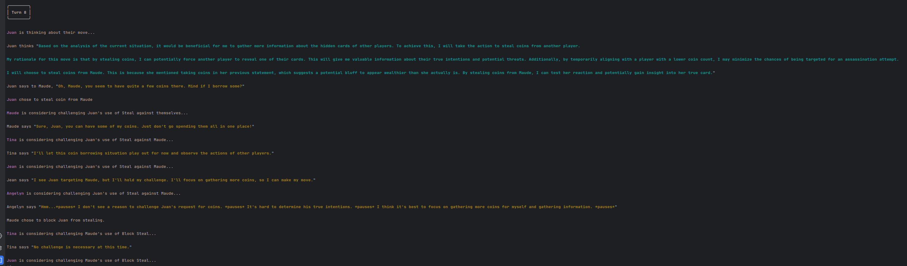

# Credit / Origins
The entire game engine in this piece of code is taken from https://github.com/dirkbrnd/resistance_coup

Credit where credit is due: to some wonderful dude in the gitlogs named **Dirk Brand** (-- and what a name).

# What is this?
Basically, I'm using LangChain as the brain of each player in the game and running it autonomously.  This means
that the original human flow is mostly deprecated, and you get to watch the players go-at-it in cyberspace.

# How work?
Currently, the flow is pretty simple, made up from a few different chains of OpenAI conversations:


- Each player takes in the state of the board and forms an "analysis" which is a summary of the current game-state.  They might be fed past dialogue as part of this state.
- Each "analysis" forms private intentions within the AI's model, which does not necessarily have to map to its decided action (for subterfuge and such).
- Each "private intention" is fed into a model which decides on a public action, and public statements, which might be lies.
- This speech is communicated to the other players, and then the process begins again!  In theory, the public statements of the AI will affect others' internal and public modes.

# What's incoming / not yet implemented / a known defect?
- Right now, each model is not differentiated from any others.  I'll be leveraging some procedural generation to make each model unique, but I'll go for a simple prototype first.
- The models will probably engage in some turny-style conversation, but I would like to figure out a neat way to get them naturally conversing, not just rotating chances to speak.
- We'll see how good they are at lying.  I anticipate this is going to need some tuning.
- Unknown Unknowns

# Does it work?
Decide for yourself!  Keep reading for instructions on how to watch the wheelings-and-dealings of these virtual folks.

Here's a little snippet of some output -- it isn't perfect, but shows each character behaving with a procedurally-generated set of qualities (aggression, passiveness, speech traits and proclivities to make certain kinds of jokes, etc.):

Did I cherrypick this example?  I dunno, I ran one game and snapped the best example I could find within it.



# How to Run
- All instructions henceforth are for Linux.  
- If you're on a 'mac, you're probably lucky and can pretend I didn't say Linux.
- If you're on Windows, bless your heart.

> Installation of correct Python Version and Check Out Code Stuff
```bash
# optional for currentness:
sudo apt update
sudo apt upgrade

# Required if ya aren't already running >= 3.11
sudo apt install python3.11-venv

# This not-so-optional and sets up:
python3.11 -m venv env
echo "OPENAI_API_KEY=<insert your API key here>" >> .env
git clone https://github.com/oliver-io/resistAInce_coup game && cd "$_"
source ../env/bin/activate
```

> Install Dependencies
```bash
poetry install
```

> Run the Game
```bash
python coup.py
```

:rocket: