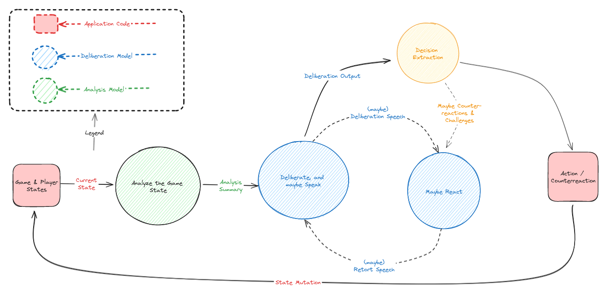

# Credit / Origins
The entire game engine in this piece of code is taken from https://github.com/dirkbrnd/resistance_coup

Credit where credit is due: to some wonderful dude in the gitlogs named **Dirk Brand** (-- and what a name).

# What is this?
Basically, I'm using LangChain as the brain of each player in the game and running it autonomously.  This means
that the original human flow is mostly deprecated, and you get to watch the players go-at-it in cyberspace.

# Does it work?
I think it works alright at the moment.  There are some examples below.  But better off, run it and decide for yourself!  

Keep reading for instructions on how to watch the wheelings-and-dealings of these virtual folks.

# How to Run
- All instructions henceforth are for Linux.
- If you're on a 'mac, you're probably lucky and can pretend I didn't say Linux.
- If you're on Windows, bless your heart.

> Installation of correct Python Version
```bash
# optional for currentness:
sudo apt update
sudo apt upgrade

# Required if ya aren't already running >= 3.11
sudo apt install python3.11-venv
# Maybe required if ya aren't already running >= 3.11
sudo add-apt-repository ppa:deadsnakes/ppa
sudo apt install python3.11-venv
```

> Check Out Code Stuff

```bash
# This not-so-optional and sets up:
git clone https://github.com/oliver-io/resistAInce_coup game && cd "$_"
python3.11 -m venv env
echo "OPENAI_API_KEY=<insert your API key here>" >> .env
source ./env/bin/activate
```

> Install Dependencies
```bash
poetry install
```

> Run the Game
```bash
python coup.py  
```

:rocket:


# How work?
Currently, the flow is pretty simple, made up from a few different chains of OpenAI conversations:

- Each player takes in the state of the board and forms an "analysis" which is a summary of the current game-state.  They might be fed past dialogue as part of this state.
- Each "analysis" forms private intentions within the AI's model, which does not necessarily have to map to its decided action (for subterfuge and such).
- Each "private intention" is fed into a model which decides on a public action, and public statements, which might be lies.
- This speech is communicated to the other players, and then the process begins again!  In theory, the public statements of the AI will affect others' internal and public modes.

Caveat:
- Many of the above steps are actually multi-agent composition steps, which are feeding into one another (including AI-to-AI interactions mid-round).




# Some Notes
- Each AI player is given some random properties which influence their:
    - "Personality" -- their general behavioral tendencies
    - "Rationality" -- how they reason about the game-state
    - "Speech" -- how they communicate, for flair
- Because each player is automated, the view of the board shifts between each player's perspective.  This means a few things:
  - The current player's interior thoughts are displayed (in blue) for the viewer's pleasure.
      - Other AIs are forming the exact same interior thoughts, but they are hidden for contextuality.
  - Statements broadcast between the AIs are displayed in yellow, and labeled text.
- The NPCs have some liberty to speak back and forth, which will influence their further speech (& actions).
- It's pretty slow, because every decision is being driven by a chain of agents analyzing the board.
  - We could speed this up at the cost of simplicity by parallelization of the search for action-taking, then polling and maybe skipping a few participants' decisions if too many want to act in a way that cannot be re-"linearized" (for example, two Challenge results).
    - For now, it really simplifies the flow to simply roll through each guy as though the card-game had a defined opportunity-phase for each player to counter, block, etc.
    - They speak arbitrarily and out of turn sometimes.


# AI Strategy

You can see that AIs are sensitive to evolving conditions in the game, including the game-theoretic tension between their strategy and other players'.  For example, contrast this first-round gameplay & dialogue against a typical mid-round where things have gotten spicier:

### Round One Rationale/Strategy:

Due to the lack of available information, the AI is conservative and considers bluffs (due to the inferred lack of available information in the others) readily.  Cooperation is also paid attention, with a desire to not aggress without a reason.


### Versus Midround Rationale/Strategy:

The relevant threats on the board are quickly identified, and the AI is still conservative, but plays its hand differently:


## Bluffing:

They're actually pretty capable of forming complex (trait-derived) bluffing and double-bluffing strategies:


# Flavor & Examples

The AIs have been procedurally generated to behave a bit differently.  Most noticeably is their speech, however, the way they communicate it's a **side-effect** of the rationalization process and should not affect their gameplay.  Their style of speech will affect the other AIs' interpretations of the conversation, however.

Their interior decisionmaking is influenced by the randomly generated properties.

### Here are some examples:

Normally they behave pretty normally and have believable conversations:


Occasionally, they have a belief that alters their strategic decisionmaking in significant ways:


Sometimes they **do a funny**:


Sometimes they speak in **movie quote references**:


Sometimes they try **weird, complicated double-bluffs**?  I dunno, Glenn did not in fact have an Ambassador...:


They will, uh, use humor to joke and occasionally debate strategies I guess?


Sometimes they do some **banter**!

Occasionally, they even speak in metaphor or rhyme, and **_poetry_**!
> (Yeah, ChatGPT invented some proc-gen qualities and I let them ride.)


Sometimes they do some **banter**!  (And yes, this is in response to the AI above who is speaking in poem.)


Here's a little snippet of some gameplay output -- it isn't perfect, but shows each character behaving with a procedurally-generated set of qualities (aggression, passiveness, speech traits and proclivities to make certain kinds of jokes, etc.):
